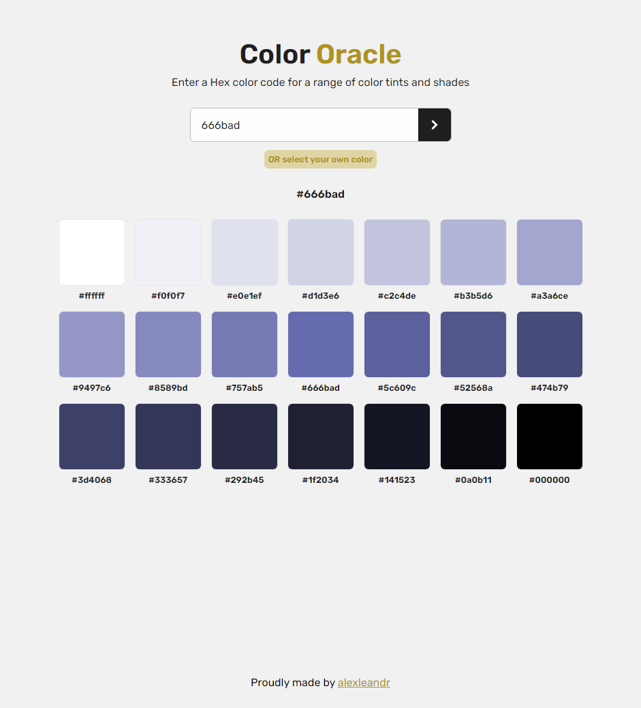

# Color Oracle

This is an app that uses react and values.js to generate tints and shades based on a Hex code you provide. It's simple and I like it that way.

Check the demo [here](https://color-oracle.vercel.app).



## Getting Started

This is a Vite app. To get started run the following commands in the root directory of the project.

```bash
npm install
npm run dev
```

Open [http://localhost:5173](http://localhost:5173) with your browser to see the result.

## License

Color Oracle is licensed under the MIT License. See the LICENSE file for more details.
